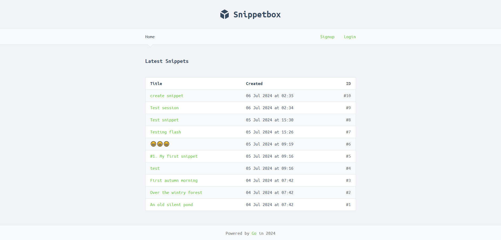
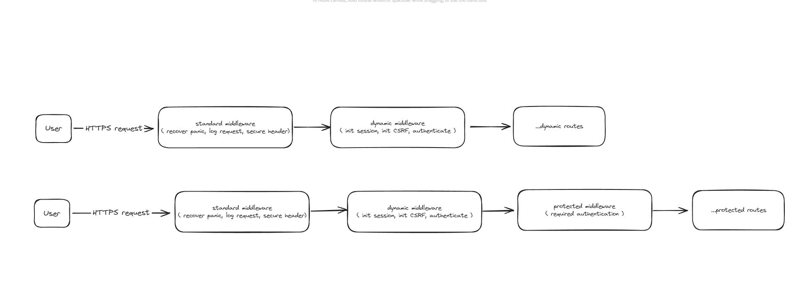

# SnippetBox - Web Application

## Resources
- [Go Official Documentation](https://go.dev/)
- [Let's Go Book - Alex Edwards](https://lets-go.alexedwards.net/)

## Functionalities
- Create, Read, Update, Delete snippets.
- Authentication and Authorization based on sessions.
- Middleware implementation for recovering from panic, logging, setting secure headers, managing sessions, preventing CSRF attacks, and authentication.
- Persisting data using a MySQL database.
- Advanced error handling.
- Displaying dynamic data from the MySQL database and creating a template cache to improve read performance.

## Setting Up

### 1. Running DBMS (MySQL) on Docker Container

#### Pull the latest MySQL image
    $ make docker.image
or

    $ docker pull mysql

#### Start a MySQL server instance on port 3306
    $ make docker.run
or

    $ docker run --name [mysql-name] -p 3306:3306 -e MYSQL_ROOT_PASSWORD=[my-secret-pw] -d mysql:[tag]

### 2. Setting Up Database and User Privileges

#### Execute commands in the MySQL database
    $ make docker.exec
or

    $ docker exec -it [mysql-name] mysql -u root -p

#### Create a new UTF-8 *snippetbox* database
```sql
CREATE DATABASE snippetbox CHARACTER SET utf8mb4 COLLATE utf8mb4_unicode_ci;
```

#### Create a new snippets table to hold the text snippets
```sql
CREATE TABLE snippets (
id INTEGER NOT NULL PRIMARY KEY AUTO_INCREMENT,
title VARCHAR(100) NOT NULL,
content TEXT NOT NULL,
created DATETIME NOT NULL,
expires DATETIME NOT NULL
);
-- Add an index on the created column
CREATE INDEX idx_snippets_created ON snippets(created);
```

#### Create a users table

```sql
CREATE TABLE users (
    id INTEGER NOT NULL PRIMARY KEY AUTO_INCREMENT,
    name VARCHAR(255) NOT NULL,
    email VARCHAR(255) NOT NULL,
    hashed_password CHAR(60) NOT NULL,
    created DATETIME NOT NULL,
    CONSTRAINT unique_email UNIQUE (email)
);
```

#### Create a new user
```sql
CREATE USER 'web'@'localhost';
GRANT SELECT, INSERT, UPDATE, DELETE ON snippetbox.* TO 'web'@'localhost';
-- Important: Make sure to swap 'pass' with a password of your own choosing
ALTER USER 'web'@'localhost' IDENTIFIED BY 'pass';
```

#### Test and check new user privileges
```sql
$ docker exec -it [mysql-name] mysql -D snippetbox -u web -p
Enter password: [secret]
mysql>
  
mysql> SELECT id, title, expires FROM snippets;
+----+------------------------+---------------------+
| id | title                  | expires             |
+----+------------------------+---------------------+
| 1  | An old silent pond     | 2023-04-05 07:20:05 |
| 2  | Over the wintry forest | 2023-04-05 07:20:05 |
| 3  | First autumn morning   | 2022-04-12 07:20:05 |
+----+------------------------+---------------------+
3 rows in set (0.00 sec)

mysql> DROP TABLE snippets;
ERROR 1142 (42000): DROP command denied to user 'web'@'localhost' for table 'snippets'
```

## Run the application on the default port [:4000](https://localhost:4000)
    $ make run


## Testing ( handlers, middleware, templates )
    $ make test

## Routes Diagram
